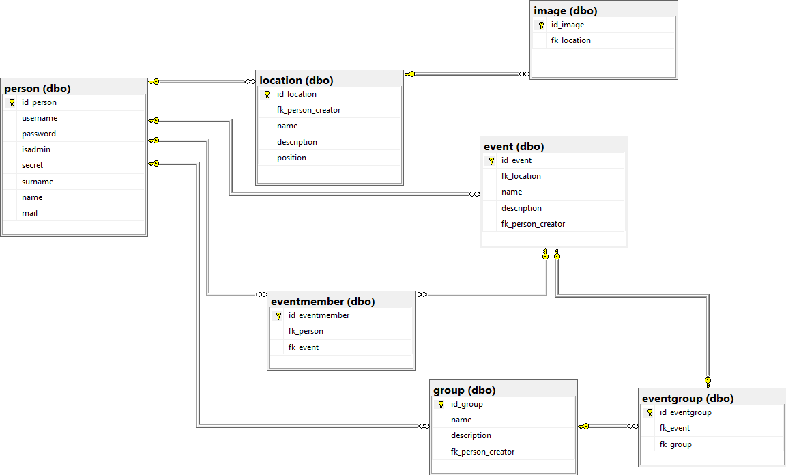

Technische Dokumentation
========================
Alain Keller, Pascal Honegger und Seraphin Rihm
Version 2, 12.04.2016
:toc:

= Konventionen
== Naming
Die allgemeinen PHP7-Namingkonventionen wurden eingehalten (Überprüft durch PhpStorm und CodeClimate). Hier einige Projektspezifische Konventionen:

* Input und Klasse wird getrennt (Input = subjectInput.php | Klasse = subjectController.php)
* Namen der Model enden mit "Model"

== HTML & CSS & JavaScript
* HTML-Styles werden immer im CSS hinterlegt
* Jegliches CSS und JS werden ausgelagert.
** Css wird in Kategorien gegliedert.
* Jedes Input benötigt ein Label oder den Label-Tag
* Code muss von CodeClimate als gut bewertet werden

== PHP
* Jedes Modul / Feature verfügt über eine eigene Klasse
* Jede Klasse ist in einer separaten Datei
* Das Model wird komplett getrennt => Ausserhalb der Models is SQL verboten
* Code muss von CodeClimate als gut bewertet werden

== Ordnerstruktur
* Für jede Unterseite wird ein neuer Ordner mit passenden Namen rstellt
* Im Ordner befinden sich die PHP- und Javascript-Dateien für diese Unterseite (ausser Model)
* Models befinden sich in einem eigenen Ordner

== Continous Integration
Wir haben die Continous Integration link:https://codeclimate.com/github/PascalHonegger/M151[Code Climate] aufgesetzt. Diese bewertet unseren Code anhand Konventionen und gibt danach eine Punktzahl
Dadurch möchten wir unsere allgemeine Code-Qualität verbessern!

* Jede Datei muss eine sehr gute Bewertung haben
* Falls viele Fehler anstehen, sollten diese Korrigiert werden

= Architektur
Im diesem Kapitel wird die Umsetzung der verschiedenen Funktionen im Programm beschrieben.

== Aufbau der Seite
Die Seite ist in vier Elemente unterteilt: Header, Content Navigation, Content und Footer. Diese werden in separaten Dateien erstellt. Somit können verschiedene Seiten mit dem gleichen Header dieselbe Datei brauchen.

Discover.php:
[source,PHP]
----
<!DOCTYPE html>

    <head>
        <title>Login</title>
        <link rel="stylesheet" href="../css/Style.css">
        
        
        
        
    </head>
    <body>
        

    
            <?php
                require_once "DiscoverHeader.php"; //Eigener Header

                require_once "DiscoverContent.php"; // Eigener Inhalt

                require_once "Discovercontentmenu.php"; // Eigenes Menu

                require_once "../home/Footer.php" // Allgemeiner Footer
            ?>
        

    </body>
</html>
----

== Datenbank

=== Benutzer
Beim Benutzer werden die Daten der Benutzer abgespeichert. Das Passwort wird von der Applikation verschlüsselt in der Datenbank abgespeichert.

=== Event
Ein Event wird immer von einem Benutzer erstellt. Zusätzlich werden Name, Beschreibung und Ort erfasst.

=== Ort
Orte werden immer von Benutzer erstellt. Zusätzlich werden Name, Beschreibung und die Koordinaten des Ortes gespeichert. Jeder Ort kann auch Bilder haben. Diese werden auf den Server geladen und der Ablageort wird in der Tabelle image gespeichert. Da wir noch keine Erfahrungen in Dateiuploads hatten, haben wir uns zu Übungszwecken für diese Methode entschieden.

=== Gruppe
User können auch Gruppen erstellen. Zu diesen gehören die Interessen der Gruppe und eine Beschreibung. Gruppen können auch Event zugeschrieben werden. Somit lässt sich ermitteln welche Events für welche Gruppen gemacht sind.

=== PHP
Die Verbinung von PHP zur MSSql-DB wird in einem Singelton hergestellt. Jede Datei welche Zugiff auf die Datenbank benötigt fordert diesen von einem Singelton. Die einzigen Klassen, welche zur Datenbank zugreifen sind die Models. Diese Besitzen verschiedene Funktionen welche Daten auslsesn, oder in die Datenbank speichern. 

== Login/Registrierung
Das Login erfolgt hauptsächlich über PHP. Eine Clientseitige JavaScript Funktion überprüft die Eingaben, bevor sie an den Server gesendet werden. Somit wird der Datenverkehr bei falscheingaben verringert. Im PHP werden die Daten nochmals überprüft, da man JavaScript deaktivieren oder bearbeiten kann. Die Daten werden mit den Benutzerdaten in der Datenbank verglichen, ist ein Treffer vorhanden, wird man in den Benutzerbereich weitergeleitet.

Die Registration Erfolg ähnlich. Auch hier werden zuerst die Daten clientseitig geprüft, wie z.B. ob die eingegeben E-Mail Adressse ein @ beinhaltet. Auf dem Server werden die Daten nochmals überprüft und beim Erfolg in die Datenbank gespeichert. Ist die Registrierung erfolgreich, wird der Benutzer automatisch angemeldet.

Die Verwaltung des Logins erfolgt über die PHP Session-Variablen. Die Session-Variable mit den Userdaten wird über einen Singelton verwaltet. Dieser kann die Session erzeigen, abfragen und zerstören. Am Anfang von jeder Seite wird überprüft, ob die Session noch existiert, wenn nicht wird man auf die Anmeldung/Registrierung-Seite weitergeleitet.

[source,php]
----
class CustomSession
{
    private static $instance;

    /**
     * SessionHandler constructor.
     */
    private function __construct() {
        if (session_status() == PHP_SESSION_NONE) {
            session_start();
        }
    }

    public static function getInstance()
    {
        if (!self::$instance) { // If no instance then create one
            self::$instance = new self();
        }
        return self::$instance;
    }

    public function setCurrentUser($user)
    {
        $_SESSION['CurrentUser'] = $user;
    }

    public function getCurrentUser()
    {
        return isset($_SESSION['CurrentUser']) ? $_SESSION['CurrentUser'] : null;
    }

    public function destroySession()
    {
        if (session_status() == PHP_SESSION_NONE) {
            session_start();
        }

        session_destroy();
    }
}
----

Zusätzlich haben wir den Google Authenticator implementiert. Die Api und deren Beschreibung finden Sie hier:
https://github.com/PHPGangsta/GoogleAuthenticator

== Events und Orte erstellen
Events und Orte kann man in der Seite 'Neuer Event' erstellen. Den Ort kann man nur über diese Seite erstellen. Will man einen Neuen Ort wird ein anderer Content geladen, welcher das Erstellformular für den Ort beinhaltet. Der Controller validiert die Daten und übermittelt sie dem Model, welche den Event/Ort in die Datenbank schriebt.

== Entdecken
Das Infinite-Scrolling in der Entdecken-Seite wird mit Ajax realisiert. JavaScript ruft eine Funktion auf dem Server auf, welche alle Orte zurückgibt. Zusätzlich kann man die Orte nach ihrem Namen filtern. Der Filtertext wird über Parameter PHP übergeben. Die Formatierung der Rückgabe wird übersichtshalber in einer zusätzlichen Datei gemacht.